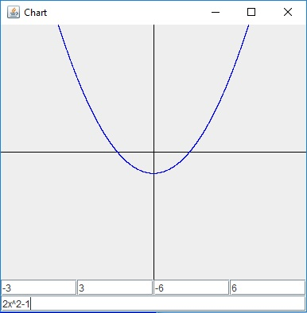

# PolynomialChart

Polynomial Chart to program rysujący wykresy dla zadanych wielomianów. Użytkownik 
dodatkowo określa wielkość układu współrzędnych. Po najechaniu myszką na wykres 
pokazują się współrzędne punktu w miejsu kursora.

# Jak używać

Pola tekstowe górne to kolejno: xmin, xmax, ymin, ymax. xmin i ymin muszą być 
ujemne.W dolne pole tekstowe wpisujemy wielomian. Program rysuje wykres po 
wciśnięciu klawisza Enter.

# Wymagania:
 - Java 8
